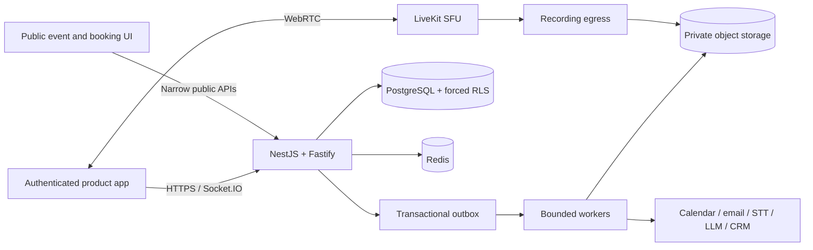

# Sessions

A clean-room, production-oriented implementation of an all-in-one platform for video meetings, webinars, interactive agendas, booking pages, collaboration, recordings, transcripts, and AI-assisted meeting memory.

This repository intentionally does **not** copy proprietary source code, visual assets, product copy, or undocumented behavior from another product. It implements the publicly described product category with an independent architecture, source tree, interaction design, and delivery plan.

## Current implementation

The repository now contains runnable vertical slices rather than placeholder-only modules:

- **Tenant-safe platform core:** organizations, multiple workspaces, role-scoped memberships, email/password accounts, expiring invitations, rotating login sessions, password recovery, optional TOTP MFA with recovery codes, deterministic development identity, separate database roles, forced PostgreSQL row-level security, audit records, idempotency records, optimistic concurrency, and a transactional outbox.
- **Meetings and rooms:** reusable permanent rooms, session creation/scheduling, guarded lifecycle transitions, interactive agenda items, realtime agenda activation, LiveKit room tokens, and a browser meeting stage.
- **Durable collaboration:** authenticated presence, persisted public/host chat, polls with launch/answer/results/close lifecycle, moderated Q&A, voting, and realtime committed-event broadcasts.
- **Webinars and events:** event drafts, publish/cancel lifecycle, atomic webinar-session creation, public event pages, registration, capacity handling, waitlisting, and registration administration.
- **Booking pages:** workspace page management, IANA-timezone availability, minimum notice, buffers, bounded slot generation, conflict filtering, advisory locking, and atomic reservation plus scheduled-session creation.
- **Governed recording and meeting memory:** durable per-participant recording consent, media-token enforcement, LiveKit room-composite egress, private S3-compatible storage, short-lived signed playback/download grants, retention and deletion processing, transcript/summary state models, searchable memory and controlled retries.
- **Public journeys:** original public event-registration and booking interfaces in the website application.
- **Operations:** Docker Compose for PostgreSQL, Redis, MinIO, LiveKit, and LiveKit Egress; database migrations; deterministic seed data; CI migration smoke tests; quality gates; architecture, API, testing, security, and delivery-status documentation.

Provider-dependent runtime qualification is deliberately not represented as complete. The local stack now contains LiveKit egress and signed recording access, but multi-node media/egress load qualification, provider webhook reconciliation, operational recovery, and disaster-recovery exercises remain release gates. Speech-to-text execution, LLM execution, calendar OAuth, reminder delivery, external OIDC/SAML identity providers, custom domains, analytics, billing, and enterprise controls also remain explicit delivery gates. See [`docs/implementation-status.md`](docs/implementation-status.md) and [`docs/backlog.md`](docs/backlog.md).

## Architecture at a glance



The first delivery topology is a modular monolith plus separately scalable workers and media infrastructure. Domain boundaries and durable events allow services to be extracted only when independent scaling, security, runtime, or release requirements justify the operational cost.

## Repository layout

```text
backend/                 NestJS + Fastify API, domain modules, Prisma and workers
frontend/                Authenticated React/Vite product application
website/                 Marketing site plus public event and booking journeys
packages/contracts/      Shared request/response schemas and TypeScript types
infra/                   Local media, TURN, database and deployment foundations
docs/                    Architecture, API, data model, ADRs, testing and status
```

## Local development

### Prerequisites

- Node.js 22
- npm 10+
- Docker with Compose v2

### Start dependencies and applications

```bash
cp .env.example .env
npm install
npm run db:generate

docker compose up -d postgres redis minio minio-create-bucket livekit egress
npm run db:migrate
npm run db:seed
npm run dev
```

When the API runs directly through `npm run dev`, set `LIVEKIT_EGRESS_ENABLED=true` in `.env` to run the recording worker. The complete Docker Compose stack sets this value for the API container automatically.

Open:

- Product application: `http://localhost:3000`
- Public website: `http://localhost:3001`
- API and Swagger: `http://localhost:4000/docs`
- LiveKit websocket: `ws://localhost:7880`
- MinIO console: `http://localhost:9001`

The seed creates the deterministic local organization `sessions-local`, workspace `product-team`, and owner identity described in `.env.example`. Development bootstrap now creates the same rotating, revocable login-session records used by local authentication. The API refuses deterministic development bootstrap in production.

### Authentication modes

- `AUTH_MODE=development` and `VITE_AUTH_MODE=development`: deterministic seeded identity for rapid local work, backed by managed refresh sessions.
- `AUTH_MODE=local` and `VITE_AUTH_MODE=local`: email/password signup and login, email verification policy, password recovery, TOTP MFA, recovery codes, workspace invitations, session rotation/revocation, and workspace switching.
- `AUTH_MODE=oidc`: reserved boundary for an external OIDC/SAML identity provider. Provider redirect, callback, claims mapping, and SCIM are not yet represented as complete.

The local seed password is controlled by `DEV_USER_PASSWORD`. Production local-auth deployments must use email verification and non-example JWT, auth-encryption, and IP-hashing secrets.

### Run the complete local stack in containers

```bash
cp .env.example .env
docker compose up --build
```

### Quality gates

```bash
npm run format
npm run format:check
npm run lint
npm run typecheck
npm run test
npm run build
```

The CI workflow also deploys all migrations against a fresh PostgreSQL service.

## Useful local workflows

### Create and run a meeting

1. Open the product application.
2. Create a scheduled or instant session.
3. Add agenda items.
4. Start the session.
5. For a recording-enabled session, accept the versioned recording notice before requesting LiveKit media access.
6. Open the LiveKit media stage and use the Chat, Polls, and Q&A tabs.
7. End the session; the recording worker stops and reconciles the room-composite egress job.
8. Open Memory to inspect processing state and request a short-lived playback or download grant when the recording is ready.

### Publish an event

1. Open Events and create a draft.
2. Publish it; the backend atomically creates a scheduled webinar session.
3. Open the public route `/events/sessions-local/product-team/<event-slug>` on the website.
4. Submit a registration. Capacity overflow enters the waitlist.

### Publish a booking page

1. Open Bookings and create a page.
2. Open `/book/sessions-local/product-team/<booking-slug>` on the website.
3. Choose a generated slot and submit attendee details.
4. The backend locks the page, revalidates availability, and atomically creates the reservation and scheduled meeting.

## API conventions

- Base path: `/v1`
- Authenticated operations: bearer JWT with immutable organization/workspace/user/role claims
- Public routes: resolve a published resource from organization/workspace/resource slugs and never accept arbitrary tenant IDs
- Create commands: `Idempotency-Key` where duplicate execution would be harmful
- Versioned updates: `If-Match` with the current integer resource version
- Success envelope: `{ data, meta }`
- Failure envelope: `{ error: { code, message, details?, requestId }, meta }`
- Swagger: `/docs` outside production unless explicitly enabled

See [`docs/api.md`](docs/api.md) for the implemented endpoint inventory.

## Security baseline

The platform uses verified tenant claims, application authorization, separate API/worker/migration database roles, forced RLS on tenant-owned tables, signed short-lived media grants, private object-storage access, audit evidence, environment validation, recording-consent requirements, bounded public endpoints, and explicit failure states. See [`SECURITY.md`](SECURITY.md), [`docs/architecture.md`](docs/architecture.md), and [`docs/testing.md`](docs/testing.md).

## Delivery order from here

1. STT provider abstraction, recording-to-audio preparation, live captions, diarization, transcript correction, and indexed search.
2. External OIDC/SAML, enterprise SSO, SCIM, step-up policies, and identity-provider operational qualification.
3. Calendar OAuth/busy-time sync, booking reschedule/cancel, ICS, notifications, and reminder reconciliation.
4. Whiteboards, breakouts, rich content blocks, safe embeds, file quarantine, and malware scanning.
5. Provider-abstracted AI generation, human review, grounded citations, evaluation, and approved follow-up actions.
6. Webhook/API-key administration, connector credentials, replay controls, and integration qualification.
7. Analytics, branding/domains, localization, billing, enterprise policy, load qualification, observability, backups, and disaster recovery.

## License

No license has been selected. Until an explicit license is added by the repository owner, all rights are reserved.
