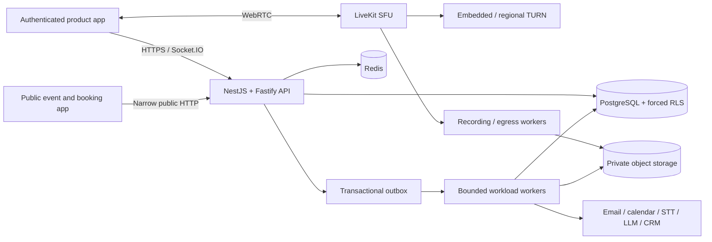
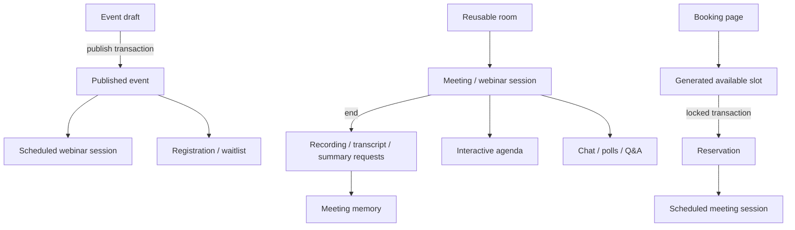
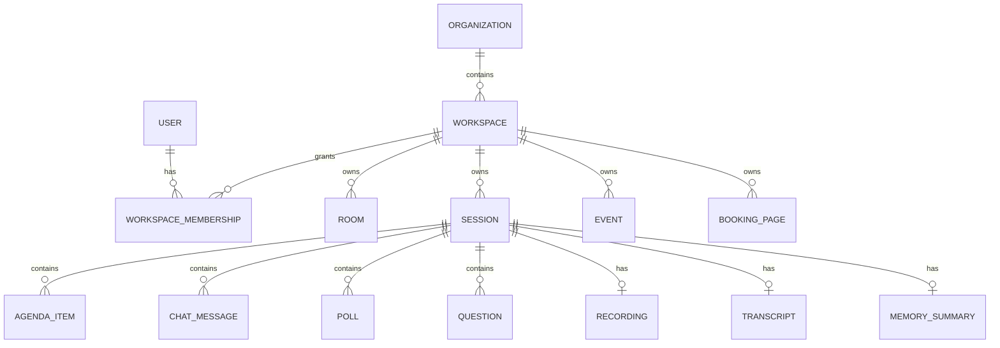
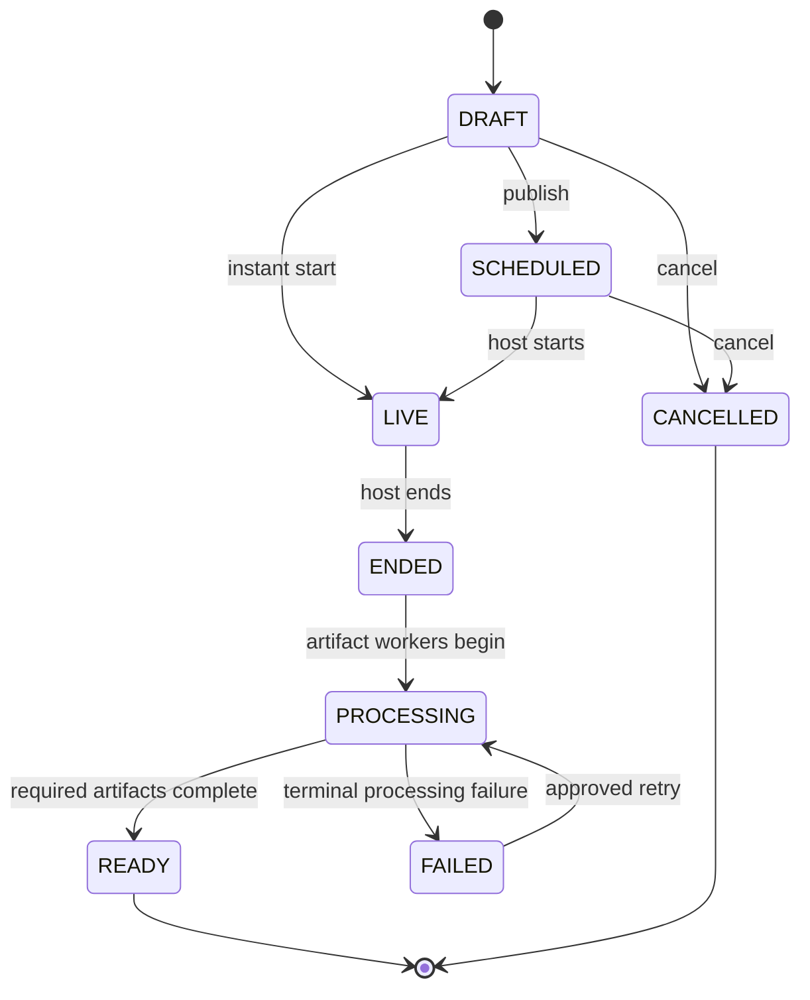
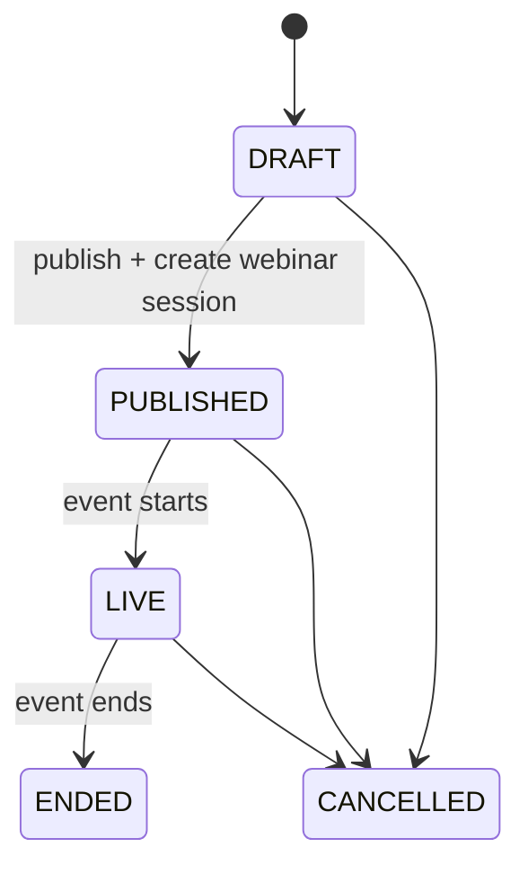
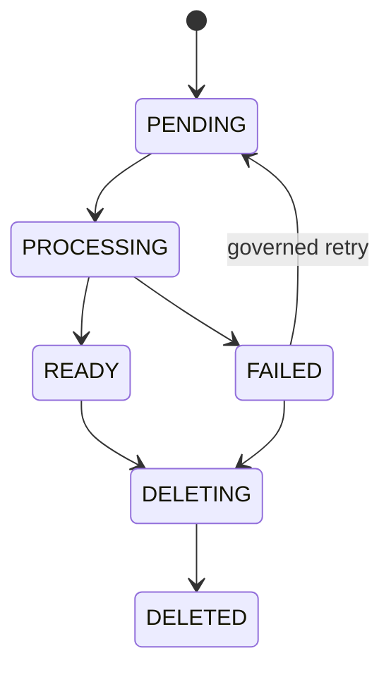

# Architecture

## System context

## Architectural choice

The product starts as a modular NestJS application with separate media infrastructure and extraction-ready workers. Premature microservices would multiply deployment, tracing, consistency, and incident complexity before the domain boundaries and traffic profiles are measured. Modules communicate through explicit services and durable outbox events so recording, transcription, notifications, integrations, analytics, and AI can become independently deployed services when scaling or security needs justify it.

## Runtime boundaries

- **HTTP API:** tenant-scoped CRUD, session commands, scheduling, registrations, artifact retrieval, administration, and provider callbacks.
- **Public API boundary:** reduced projections for published events and active booking pages. Tenant scope is derived from verified slugs, never caller-provided IDs.
- **Socket.IO gateway:** authenticated presence and broadcast of already committed agenda/chat/poll/Q&A/memory events.
- **LiveKit media plane:** audio, video, screen share, adaptive subscriptions, and room-scoped media authorization.
- **Outbox relay:** claims committed events, publishes to Redis Streams, retries with exponential backoff, and dead-letters terminal failures.
- **Workers:** recording finalization, transcription, summaries, reminders, webhooks, retention, export, and deletion. Only the dispatch foundation and work requests are currently implemented for provider-dependent jobs.
- **Object storage:** private recording objects, HLS/MP4 derivatives, transcripts, exports, thumbnails, and quarantined uploads.

## Domain flow

## Tenant model and isolation

The bearer token supplies immutable `organizationId`, `workspaceId`, `userId`, and role claims. Every authenticated tenant transaction sets PostgreSQL `app.organization_id` and `app.workspace_id`. Forced RLS rejects cross-workspace reads and writes even when an application query omits a filter. Object keys, caches, realtime rooms, search documents, and analytics events must use the same scope.

Public endpoints are intentionally narrow. They resolve an organization/workspace/resource by slug, require the resource to be published or active, return a reduced projection, and perform mutations using a trusted server-side database boundary. Production should give this boundary a purpose-built database role and abuse controls rather than reusing a broad worker role.

## State machines

### Session

### Event

### Artifacts

Transitions are validated server-side. Commands that have asynchronous consequences write the state change, audit evidence, and outbox event atomically.

## Scheduling consistency

Slot generation uses the booking page's IANA timezone and applies minimum notice, duration, and before/after buffers. Public reservation creation obtains a page-scoped PostgreSQL advisory transaction lock, recomputes availability, creates the reservation, and creates the scheduled session in one transaction. A database uniqueness constraint is the final duplicate defense. External calendar busy intervals will be added as another conflict source rather than replacing these controls.

## Collaboration consistency

Chat, poll, Q&A, and agenda commands are durable database commands. The API broadcasts their committed projection only after the transaction completes. Clients use realtime notifications to invalidate and reread state. A Redis/NATS fanout adapter, stream positions, reconnect cursors, and leased presence are required before horizontally scaling gateway replicas.

## Recording and AI pipeline direction

Ending a session with capture enabled creates explicit `PENDING` artifacts and outbox requests. Future workers will:

1. start/finalize LiveKit egress under verified consent;
2. write encrypted private objects and metadata;
3. submit audio to a configured STT provider;
4. persist speaker/timestamp transcript segments;
5. index workspace-filtered search documents;
6. run opt-in summary/action extraction;
7. return labeled, cited, editable output for human review;
8. trigger external updates only after explicit approval.

A model row or pending request is not evidence that provider processing succeeded.

## Reliability patterns

- `Idempotency-Key` protects externally retried create commands.
- Integer versions and `If-Match` prevent lost updates.
- Advisory transaction locks serialize booking/event capacity decisions where necessary.
- Database uniqueness constraints provide a final concurrency defense.
- Transactional outbox avoids dual-write loss.
- Bounded attempts, exponential backoff, lock expiry, dead-letter state, and future governed replay protect asynchronous delivery.
- Redis loss may affect transient presence or event notification but cannot corrupt durable state.
- Artifact readiness is eventually consistent and represented explicitly.

## Security boundaries

- LiveKit API secrets never leave the backend; browsers receive short-lived room-scoped grants.
- Production identity must use verified OIDC/SAML and revocable sessions; development JWT bootstrap is disabled in production.
- Recording/transcription require visible disclosure, policy-driven consent, active indicators, audited access, retention, and deletion.
- External content requires allow-listed origins, CSP, sandboxed iframes, upload quarantine, malware scanning, and explicit remote-control grants.
- OAuth credentials and provider secrets belong in a managed vault with rotation and tenant ownership.
- AI is provider-abstracted, opt-in, asynchronous, reviewable, and prohibited from autonomous external actions.
- Exports and deletion cover rows, objects, search indexes, analytics copies, and backups according to policy.

## Initial production topology

- CDN/WAF for public/static traffic.
- Load balancer for API and WebSocket traffic.
- Stateless API replicas and separately bounded worker pools.
- Managed PostgreSQL with PITR and separate migrator/API/worker roles.
- Managed Redis configured for availability, not used as the source of truth.
- S3-compatible private object storage, lifecycle rules, quarantine, encryption, CDN, and signed access.
- Regional LiveKit and TURN capacity plus isolated egress workers.
- Central logs, metrics, traces, error tracking, alerting, and synthetic meeting checks.

## Scale path

1. Scale API, realtime gateway, workers, SFU, TURN, and egress independently.
2. Partition worker queues by latency and resource class so AI cannot starve reminders or webhooks.
3. Route media sessions to a home region and keep tenant data residency policy explicit.
4. Introduce regional cells for blast-radius and residency control.
5. Extract a domain only when measured scaling, runtime, security, ownership, or release constraints justify it.
6. Qualify backup restoration, regional recovery, load, packet loss, reconnect, and chaos behavior before enterprise release.
