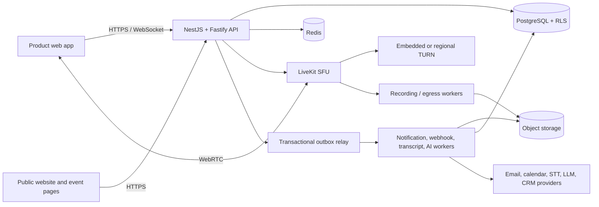
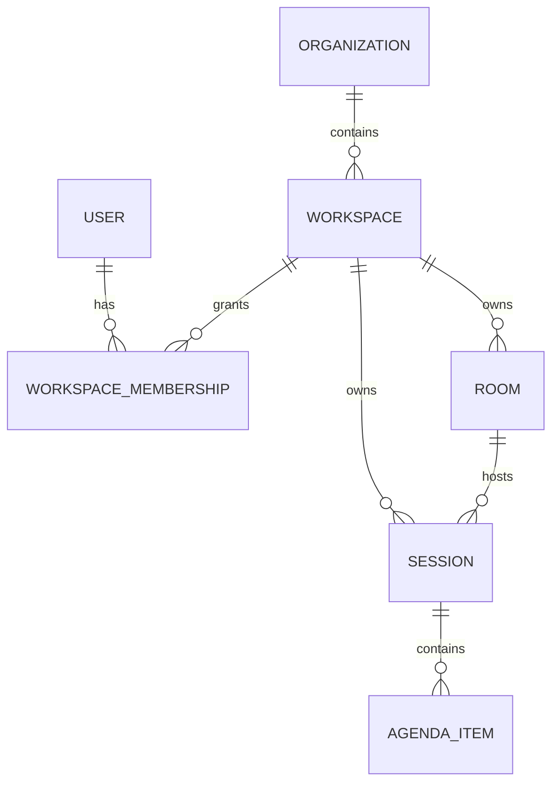
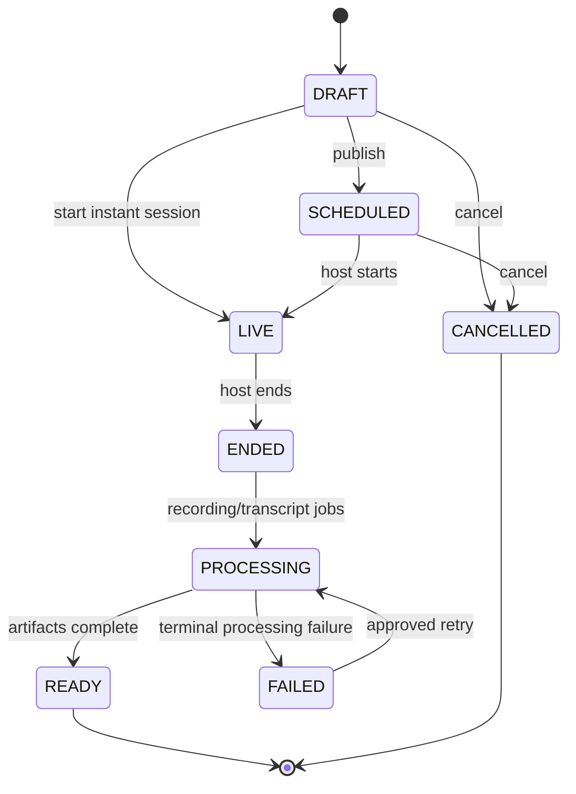

# Architecture

## Target system context

## Runtime boundaries

- **HTTP API:** durable CRUD, authorization, uploads, scheduling, memory retrieval, administration, and provider callbacks.
- **WebSocket gateway:** participant presence, agenda activation, chat, poll state, Q&A, and whiteboard coordination.
- **WebRTC SFU:** audio, video, screen share, simulcast, and data-channel media transport.
- **Workers:** the current API process includes the outbox relay foundation; production separates outbox delivery, recording finalization, transcription, summaries, reminders, webhooks, retention, exports, and deletion into bounded workers.
- **Object storage:** recordings, HLS segments, transcripts, exports, thumbnails, and quarantined uploads.

## Tenant model

The bearer token supplies immutable `organizationId`, `workspaceId`, `userId`, and role claims. Every tenant transaction sets PostgreSQL `app.organization_id` and `app.workspace_id`; RLS rejects cross-workspace reads and writes even if an application query omits a filter. Object keys and Redis keys must also be namespaced by workspace.

## Session state machine

Transitions are validated server-side. Each accepted transition writes the domain change, audit record, and outbox event atomically.

## Reliability patterns

- `Idempotency-Key` protects externally retried create commands.
- Integer resource versions and `If-Match` prevent lost updates.
- Transactional outbox avoids dual-write loss between PostgreSQL and asynchronous workers.
- The implemented outbox relay uses bounded retries, exponential backoff, and dead-letter state; governed replay tooling remains a delivery gate.
- Recording and transcript readiness are eventually consistent and represented explicitly.
- Redis loss may affect transient presence but must not corrupt durable meeting state.

## Security boundaries

- LiveKit API secrets never leave the backend; browsers receive short-lived room-scoped tokens.
- Recording consent and active indicators are mandatory before media capture.
- External content uses allow-listed origins, strict CSP, sandboxed iframes, and user-mediated remote-control grants.
- AI is provider-abstracted, opt-in, asynchronous, reviewable, and prohibited from autonomously sending external updates.
- Deletion and export workflows cover database rows, search indexes, object storage, analytics copies, and backups according to policy.

## Scale path

The first production topology runs stateless API replicas, separate workers, managed PostgreSQL, managed Redis, object storage/CDN, LiveKit nodes, and regional TURN. The system can later move high-volume modules into regional cells while preserving organization/workspace routing and contract compatibility.
