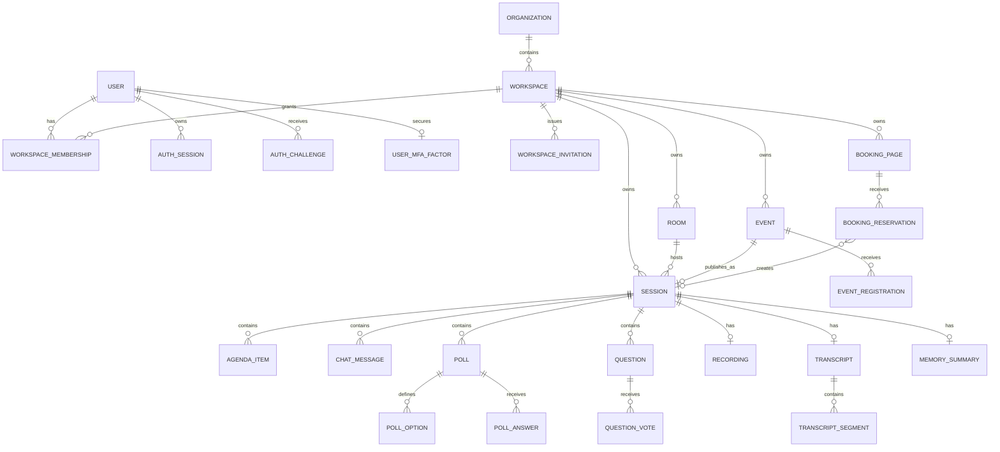

# Data model

PostgreSQL is the durable source of truth. Redis is used only for ephemeral coordination, streams, locks, and presence. Media and generated artifacts are referenced from PostgreSQL but stored in private object storage.

## Tenancy and identity

- `organizations`
- `workspaces`
- `users`
- `workspace_memberships`

Authenticated requests carry immutable `organizationId`, `workspaceId`, `userId`, and role claims. Every tenant transaction sets transaction-local PostgreSQL variables. Forced row-level security rejects rows whose organization/workspace values do not match the verified context.

Production uses separate database identities:

- **Migrator:** owns schema deployment and grants.
- **API role:** normal authenticated tenant traffic, constrained by RLS.
- **Worker/control-plane role:** trusted identity and bounded-worker operations that must scope every lookup explicitly before touching tenant data.

### Account and login security

- `auth_sessions`
- `auth_challenges`
- `user_mfa_factors`
- `email_verification_tokens`
- `password_reset_tokens`
- `workspace_invitations`

Users are global identities and receive access through workspace memberships. Passwords are stored as versioned scrypt hashes with per-password salts. Access tokens are short-lived JWTs containing a login-session identifier; the guard re-reads the session, active user, workspace membership and current role. Refresh credentials are opaque `id.secret` values: only a SHA-256 digest of the secret is stored, each use rotates the session, and reuse of a revoked token revokes the surviving token family.

TOTP secrets are encrypted with AES-256-GCM and recovery codes are stored only as one-way hashes. Login challenges have bounded attempts and expiry. Verification, password-reset and invitation tokens use opaque secrets, expiry, single-use state and advisory transaction locks to prevent concurrent replay. Invitations are workspace scoped, role scoped, expiring and revocable; a partial unique index prevents duplicate active invitations for the same email.

The `sessions_api` role is explicitly denied access to authentication-secret tables. Identity operations use the separately governed control-plane connection, while normal business operations continue through forced tenant RLS. `workspace_invitations` retain tenant columns and forced RLS because they are also visible in workspace administration.

## Meetings and rooms

- `rooms`
- `sessions`
- `agenda_items`

A reusable room owns stable defaults and a workspace-scoped slug. A session owns lifecycle state, media-room identity, schedule, recording/transcription preferences, and the active agenda item. Agenda positions are unique per session and reorder operations are performed transactionally.

## Events and registrations

- `events`
- `event_registrations`

An event starts as a draft. Publishing it atomically creates a scheduled `WEBINAR` session and links `events.session_id`. Public registration resolves the event using organization, workspace, and event slugs; it never accepts tenant identifiers from the caller. Registrations are unique by event and case-insensitive email. Capacity overflow produces `WAITLISTED` rather than an over-capacity confirmed record.

Primary states:

```text
Event: DRAFT → PUBLISHED → LIVE → ENDED
                    └──────────→ CANCELLED
Registration: REGISTERED | WAITLISTED | CANCELLED | ATTENDED | NO_SHOW
```

## Booking pages and reservations

- `booking_pages`
- `booking_reservations`

Booking pages store:

- IANA timezone
- duration
- minimum notice
- before/after buffers
- weekly availability rules
- intake-field definitions
- active state and optimistic version

A public reservation is created under a page-scoped PostgreSQL advisory lock. The service recomputes availability after locking, writes the reservation, and creates its scheduled meeting in one transaction. A unique `(booking_page_id, starts_at)` constraint is a final defense against duplicate slots.

Primary states:

```text
Reservation: CONFIRMED | CANCELLED | COMPLETED | NO_SHOW
```

Calendar busy intervals, rescheduling, cancellation policy, and provider synchronization remain separate models to add before production scheduling qualification.

## In-session collaboration

- `chat_messages`
- `polls`
- `poll_options`
- `poll_answers`
- `questions`
- `question_votes`

Chat is durable and currently supports `EVERYONE` and `HOSTS` channels. Polls support single choice, multiple choice, open text, NPS, and word cloud domain types. A respondent has one upserted answer per poll. Questions support moderation, answers, anonymity, and one toggleable vote per voter key.

The database write commits before a realtime event is broadcast. Redis or Socket.IO state never becomes the authoritative history.

## Recording, transcript, and meeting memory

- `recordings`
- `transcripts`
- `transcript_segments`
- `memory_summaries`

Artifacts use explicit lifecycle states:

```text
PENDING → PROCESSING → READY
                  └──→ FAILED → PENDING (governed retry)
READY | FAILED → DELETING → DELETED
```

A recording stores provider/job references, private object keys, playback object keys, duration, consent snapshot, timestamps, and failure state. A transcript stores full text plus ordered speaker/timestamp segments. A memory summary stores reviewed summary text, structured decisions, action items, and citations.

Ending a session creates only the artifacts enabled by policy/preferences and writes processing requests to the transactional outbox. Creating a row does not imply that a provider job has succeeded.

## Platform reliability and governance

- `idempotency_keys`
- `outbox_events`
- `audit_events`

`idempotency_keys` bind a key to a request hash and serialized response, preventing retries from creating duplicate resources or reusing a key with different input. `outbox_events` are written in the same transaction as state changes and include bounded attempts, next availability, locks, publication time, error text, and dead-letter time. `audit_events` are append-only evidence for administrative and security-sensitive actions.

## Implemented relationship overview



## Data rules

- Human-readable slugs are unique only inside their owning workspace.
- Mutable concurrently edited resources carry an integer version.
- External provider identifiers are stored with provider, account, tenant, and lifecycle context; they never grant access by themselves.
- Object keys are server-generated and begin with organization/workspace scope.
- Every tenant-owned cache, socket room, search document, and analytics event must include tenant scope.
- Usage and audit ledgers are append-only; corrections use compensating records.
- Public endpoints return a reduced projection and do not expose internal ownership or provider metadata.
- Personally identifiable data is classified, retained, exported, and deleted according to workspace policy.

## Planned data domains

The following remain planned or require deeper implementation:

- OIDC/SAML connections, SCIM provisioning, step-up policy, organization lifecycle and richer security-event projections
- attendance intervals, participant devices, reactions and private chat channels
- whiteboards, snapshots, operation compaction, breakout rooms and assignments
- content blocks, upload quarantine, asset provenance, embed connections and control grants
- calendar connections, busy intervals, availability exceptions, reschedule/cancel history
- notification templates, jobs, deliveries, bounces and reconciliation
- artifact shares, retention jobs, deletion jobs, transcript revisions and search indexes
- AI jobs, provider runs, evaluations, feedback and approved external-action records
- API keys, webhook endpoints/deliveries, OAuth installations and sync cursors
- branding themes, domains, verification, plans, subscriptions, entitlements and usage ledger
